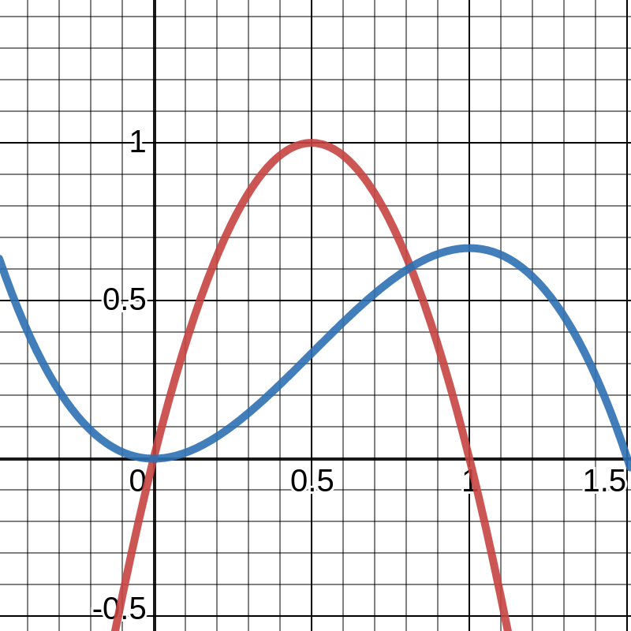
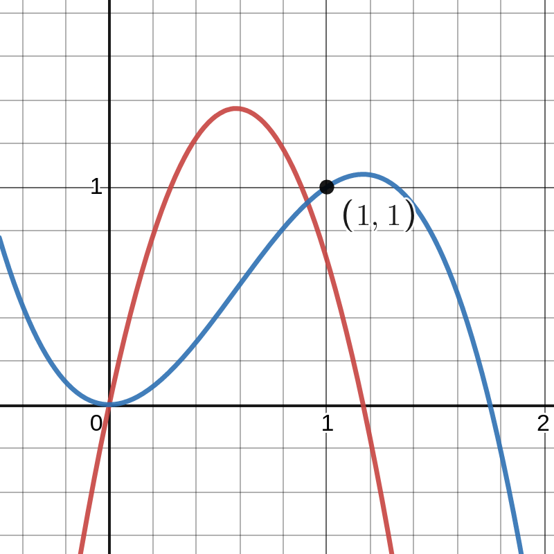
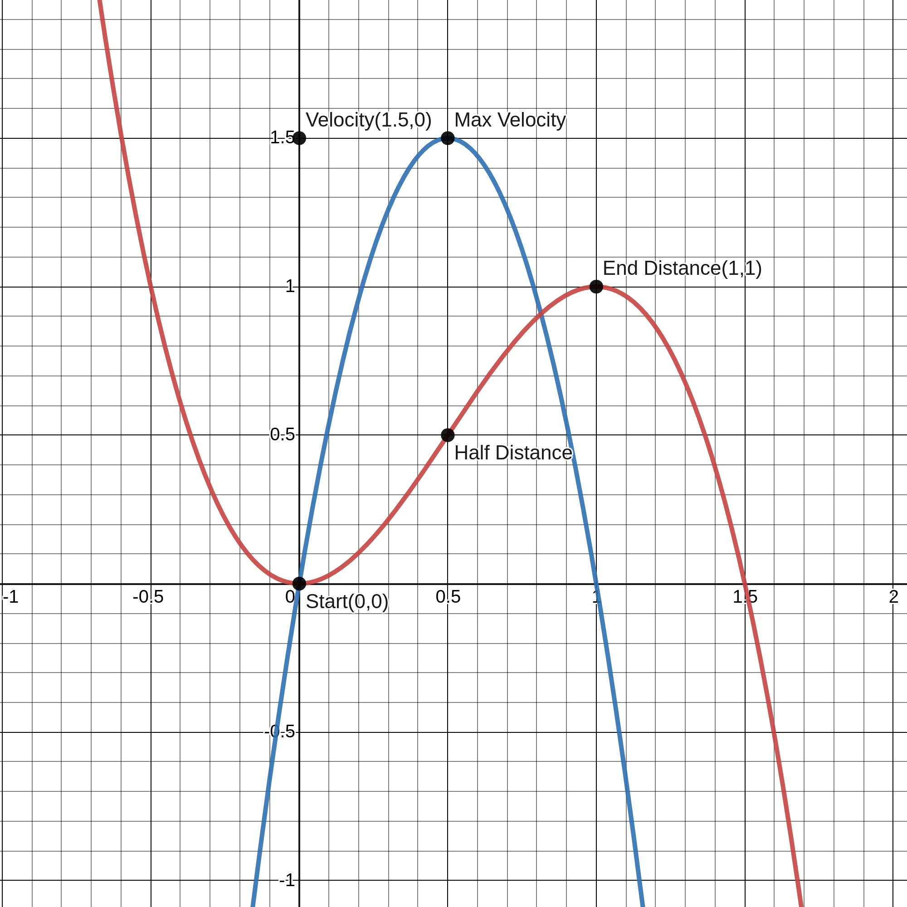

# How the Camera Animation Works

The following is just a rushed draft I made while deciding how camera movement should work.

In summary, I want a camera that move in a smooth acceleration. To have a smooth 
start and end of acceleration, I found the shape of the velocity. After that,
we get the position graph by integrating the previous equation. The advantage of 
knowing the position x time is that any latency will not affect the camera's 
movement.

Notice how, in the last graph, the max velocity is achieved when time is 0.5t.
The equation uses proportions. Where 0,5t means half the time, 0.5 distance means 
half the distance, 1.5 velocity means 100% of the velocity. We can choose the max 
velocity, the max distance and the max time however we want. The proportion will
remain the same.

Velocity function (red)
Y = -4x² +4x

Distance travelled function (blue)
s = -4/3x³ + 2x² + c   with c = 0

X axis is time proportion, from 0 to 1.
Y is velocity proportion, from 0 to 1.
Choose a value for max time and max distance. Use this graph to get velocity/distance per frame.

s = -4/3x³ + 2x² when x = 1

s =-4/3 + 2 = 2/3 of max velocity.

Given function y=-4/3 x³ + bx²

What is the value of b such that the point (1,1) exists in the function?

1=-4/3 + b

b= 7/3

So the function for distance I want is:
y = -4/3 x³ + 7/3 x²

The derivative of which becomes:

y’ = -4x² + 14/3x

So the velocity function (red) and position(blue) functions are:

Not what I want. The tip of the function should be the (1,1) point instead.

Back to the start. The function is y’ = ax² +bx + c. Integrated it is y = 1/3ax³ + b/2 x² +cx + d.

I want a velocity function that has the points (0,0) and (1,0). A distance function that has the points (0,0) and (1,1). 

Velocity position (0.5, ?) should be the highest point of the function. Distance position (1,1) should be the highest point of that “slope”. In other words, derivative of velocity when x = 0.5 and derivative of position when x = 0 and x = 1 are 0.

y’ = ax² +bx + c

y = (1/2)ax³ + (1/2)bx² +cx + d

------------------------------------------
y’’= (a/2) x + b, y’’= 0 when x = 0.5

0 = (a/2) * ½ + b

0 = a/4 + b

b = -a/4

-----------------------------------------

when y’ = 0, x = 0 and x = 1

0 = 0 + 0 + c => c = 0

1 = a *1² + b * 1 + c => 1 = a + b + 0 => b = 1 – a
-------------------------------------------
b = 1 – a => b -1 = -a => -b +1 = a

b = -a/4 => -4b = a

-b + 1 = -4b
3b = 1
b= 1/3
--------------
b = -a/4
1/3 = -a/4
-a = 1/3 * 4
-a = 4/3
a = -4/3

--------------------------------------------
Applying “b= 1-a” to “b = -a/4”

1 - a = -a/4
1 = a – a/4
1 = ¾ a
a = 4/3
b = -(4/3)/4 => b = -1/3
---------------------------------------------
a = 4/3, b = -1/3, c = 0

y’ = 4/3 x² – 1/3x

y = (½) * (4/3) * x³ + (1/2)*(-1/3) * x² + d

y = (2/3) x³ -(1/6) * x² + d

--------------------------------
Applying position (0,0) to y

0 = (2/3) * 0 – (1/6) * 0 + d

d = 0
-------------------------------
Finally the functions that I want are:
y = (2/3)x³ – (1/6) x²
y’ = (4/3) x² – (1/3) x

-------------------------------------------------------------------------------------------

y’ = ax² +bx + c

y = (1/3)ax³ + (1/2)bx² +cx + d

y’ = 0 => x = 0 and x = 1

0 = a * 0 + b * 0 + c => c = 0

0 = a * 1 +b * 1 + c => a + b = 0 => a = -b

-----------------------------------------------------------------------------------
we have,
c = 0
a = -b
a < 0 (concavity must be down)
---------
y’’ = 2ax + b

y’’ = 0 when x = 0.5 
0 = 2 * a * ½ + b => 0 = a + b => a = -b

-----------------------------------------------------------------------------------
updating the functions
y’ = -bx² +bx
y = -(b/3)x³ + (b/2)x² + d

applying position (0. 0) and (1,1) to y
0 = -0 + 0 + d => d = 0
1 = (-b/3) * 1 + (b/2) * 1 + 0 => 1 = (-b/3) + (b/2)
1 = (-2b + 3b)/6 => 1 = 1b/6 => 6 = b

b = 6 => a = -6

-------------------------------------------
Finally we have:
y’ = ax² +bx +c => y = -6x² +6x²
y = (a/3)x³ + (b/2)x² + cx + d => y = -2x³ + 3x²

